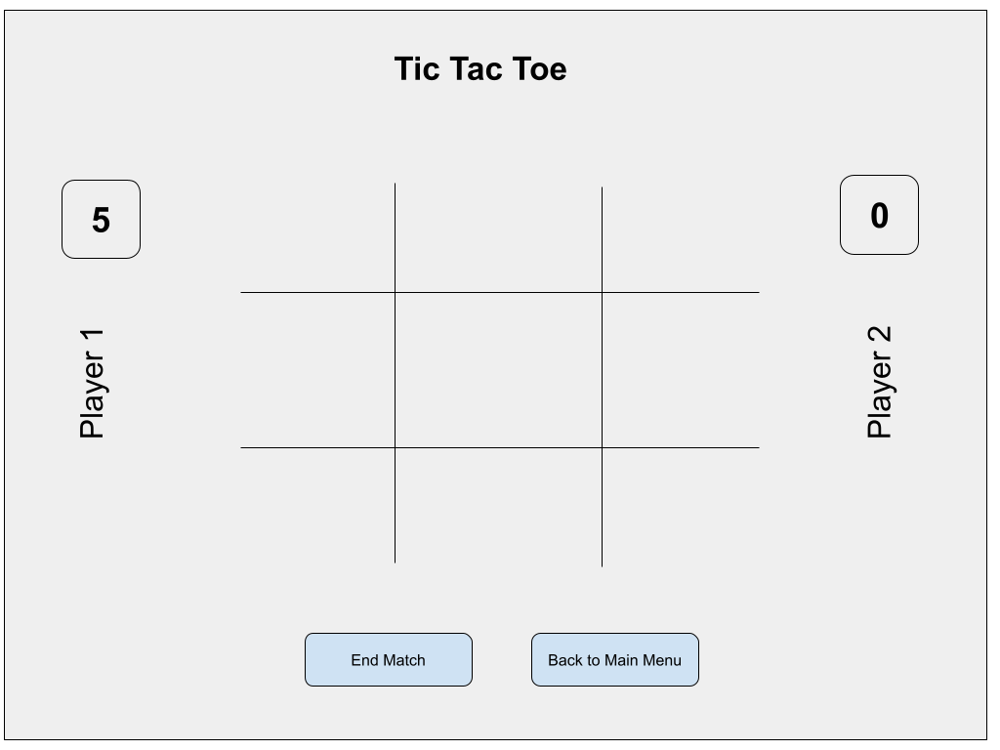

<h1 align="center"> <a href="https://www.franz-e.net/tic-tac-toe">Tic-tac-toe</a> </h1>

## Technologies Used

-   HTML
-   JavaScript
-   CSS

## Features:

-   Play against another player
-   Play against the computer

## Game Progression Design

Considering a 2 player game (Maybe computer too if there is time):

    -   Starting a game:
        -   Player selection:
            -   Select players (pvp (or pvc or cvc if there is time))
            -   Input player names
            -   Randomly choose who starts the game
            -   Initialize scores objects (vars | arrays | objects)
    -   Starting a match:
        -   Initialize board
        -   Display player names
        -   Show game score for each player
    -   During a match:
        -   Indicate which user's turn it is
        -   Track moves to determine winner
        -   Win a match (a line is formed by matching 3 cells)
        -   End a match (at any time)
    -   Winning a match:
        -   Show the match is over
        -   Show who is the match winner
        -   Keep track of matches won per player
    -   Ending a match:
        -   Ask to continue or end game
        -   If continue:
            -   Save match result
            -   Clear board
            -   Start match
    -   Ending a game:
        -   Count matches won
        -   Show who is overall winner
        -   Add to "highest score" (if there is enough time)
        -   Reset score board
        -   Clear board

## Match Draft

Overall representation of the layout during a match without styling:

## Currently working on:

-   Styling:
    -   Buttons
    -   Pop-Ups
    -   Sound FX
-   Easter Eggs
-   High scores (with local storage)

## Attributions:

-   Sound by: [LittleRobotSoundFactory](https://freesound.org/people/LittleRobotSoundFactory/)
