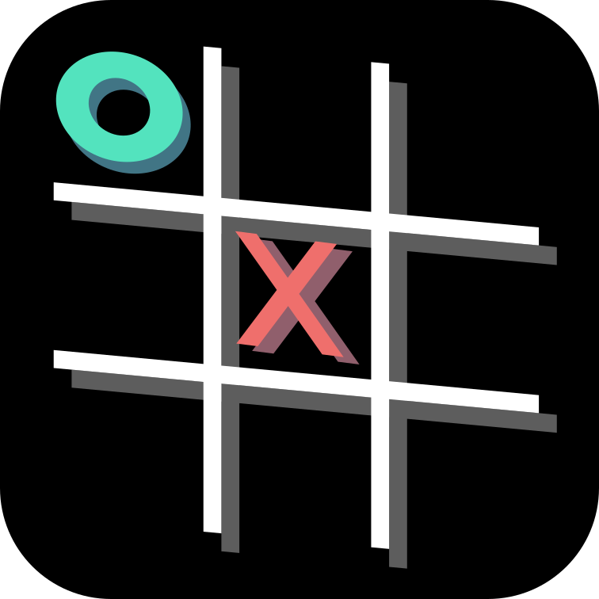
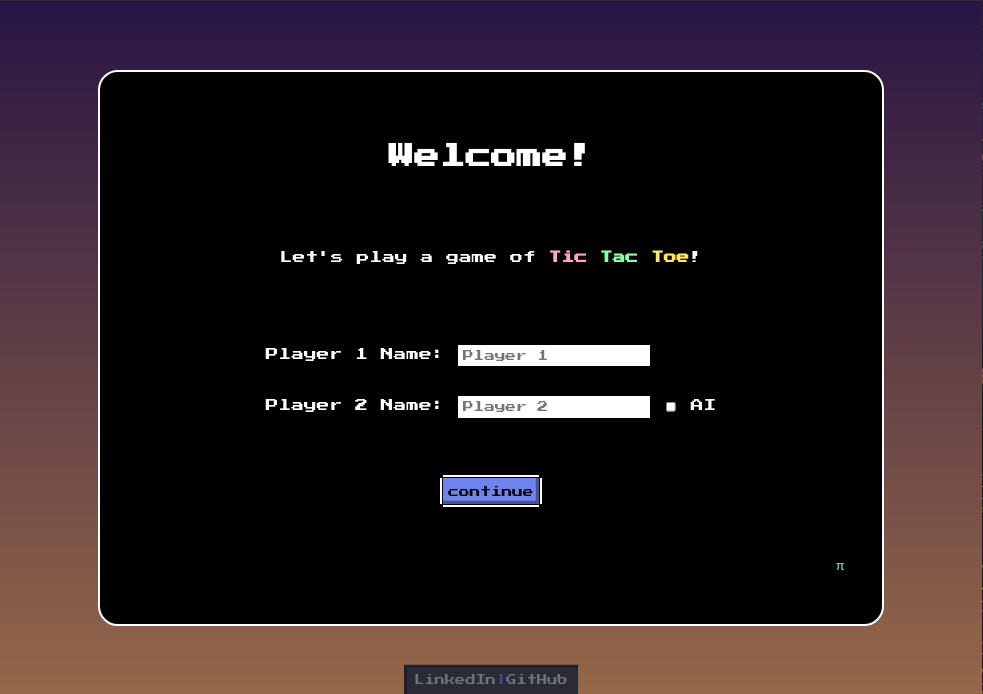
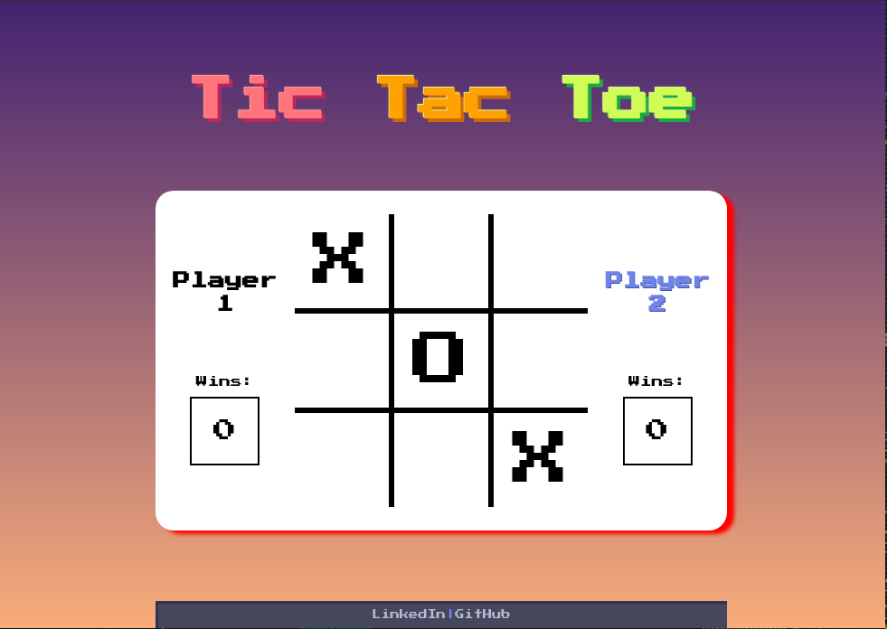
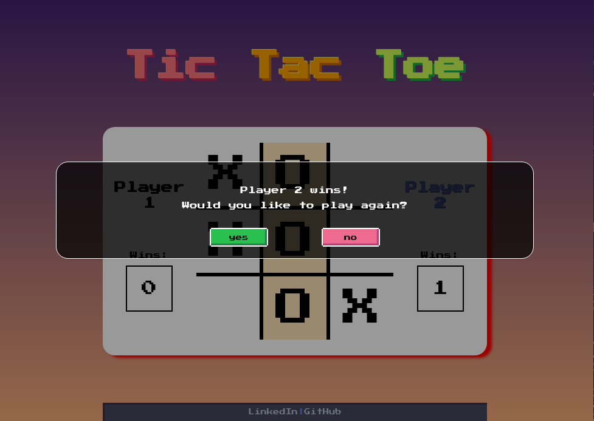
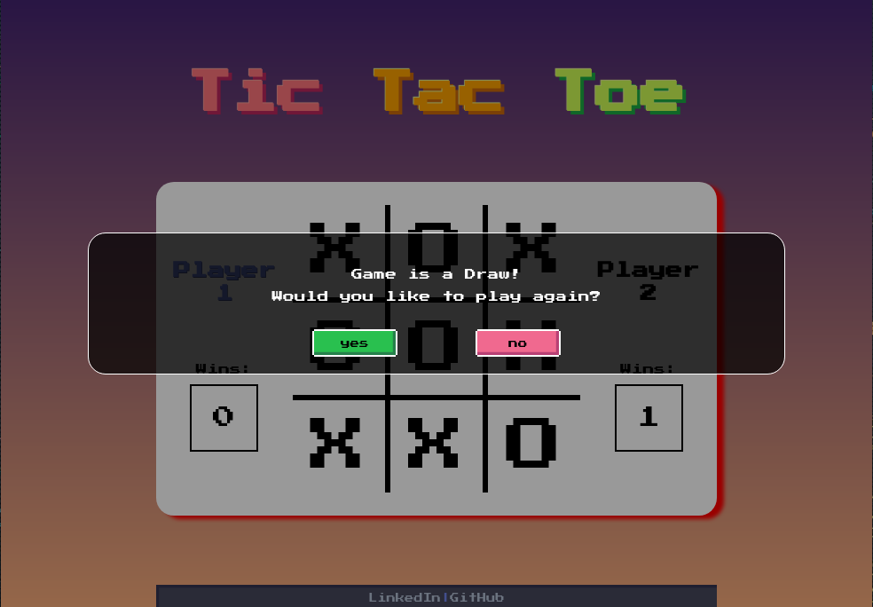
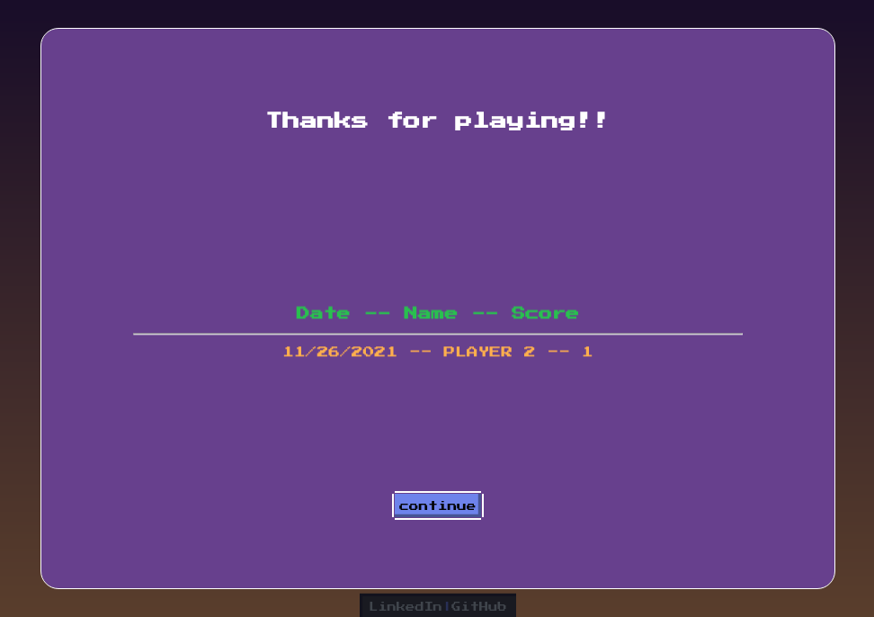

<h1 align="center"> <a href="https://www.franz-e.net/tic-tac-toe">Tic-tac-toe</a> </h1>

#### Table of contents

- [About the Project](#about-the-project)
  - [Features:](#features)
  - [Technologies Used](#technologies-used)
- [Gameplay](#gameplay)
  - [Screenshots and Media:](#screenshots-and-media)
- [Challenges and Lessons Learned](#challenges-and-lessons-learned)
- [Roadmap](#roadmap)
- [Contact](#contact)
- [Attributions:](#attributions)

---

## About the Project

First project from General Assembly Software Engineering Immersive Class, which goal is to showcase what I have learned so far in terms of JavaScript, HTML and CSS

### Features:

The game has the following features:

-   8-bit theme
-   Player name customization
-   PvP (Player vs Player)
-   PvC (Player vs Computer)
-   High Scores
-   Easter Eggs
    -   [The Net](https://www.youtube.com/watch?v=TFpKuq_tuIU&t=32s) "Pi" symbol on welcome screen - Shows high scores
    -   [Wargames](https://www.youtube.com/watch?v=F7qOV8xonfY) AI name "Joshua"

### Technologies Used

The game was developed entirely using:

-   HTML
-   JavaScript:
-   CSS

Some of the key features used:

-   Modals (HTML/JS)
-   DOM Manipulation (JS)
-   Local Storage (JS)
-   Transform (CSS)
-   Animations (CSS)
-   Media queries (CSS)

## Gameplay

-   The game begins with a splash screen that allows each player to enter its desired name or the default `Player 1` or `Player 2`

-   If playing in PvC mode, the 2nd player becomes `Joshua`.
    Once customizations are complete, the match begins.

-   The game follows the rules of the classic Tic Tac Toe where 2 players place a symbol representing each player in a 3 by 3 board.

-   Once a player reaches a 3 in a row, column or diagonal the match ends and a point is added to the user.

-   Once a match has concluded the users are presented with the opportunity to continue playing or end the game, which saves the score to the High Scores

### Screenshots and Media:

-   Initial layout draft: 
-   Welcome Screen: 
-   Main Gameplay: 
-   Winner Screen: 
-   Draw Screen: 
-   HighScores Screen: 

## Challenges and Lessons Learned

-   In General understanding the initial idea in the layout draft is just a starting guide, and the final design will change regardless as more edge cases arise

**JavaScript**

-   Deciding whether to use independent variables and arrays, or group everything together under a JS Object to simulate an instance of a Game
-   The validation for an end game scenario was interesting:
    -   There are only 8 winning combinations
    -   After each turn, and before the turns are switched the validation needs to happen as the end should finish before switching turns
-   Maintaining persistence of the overall HighScores using Local Storage
-   Leveraging bubbling to reduce the amount of listeners needed

**CSS**

-   Creating the layout with a combination of Grid and Flexbox on each container
-   Defining the right sizes on the `media query` to allow a more responsive design
-   Creating the 8-bit button style was challenging

## Roadmap

-   Smarter Computer player:
    > The current Computer player's goal is is just to play a turn on the first available cell.
-   Use Classes to instantiate a Game objects instead of a JS object to simulate an object
-   Style the `checkbox input` to match the 8-bit design

## Contact

-   [GitHub](https://github.com/franz-net/)
-   [LinkedIn](https://www.linkedin.com/in/franzramirez/)

## Attributions:

-   Sound by: [LittleRobotSoundFactory](https://freesound.org/people/LittleRobotSoundFactory/)
